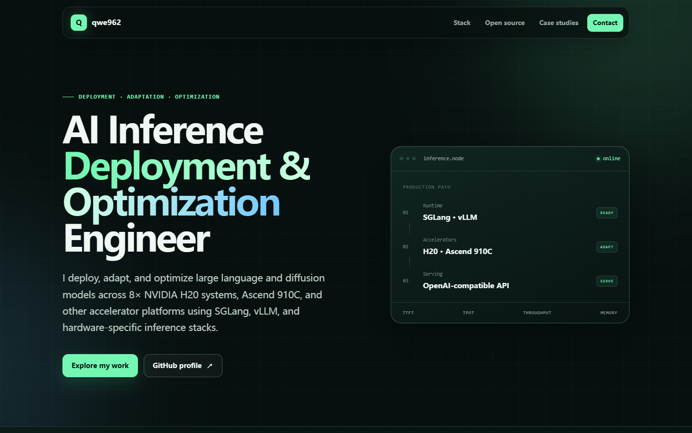

# qwe962.github.io

Personal portfolio for an AI Inference Deployment & Optimization Engineer, focused on large-model deployment, adaptation, and reliable serving across NVIDIA H20, Ascend 910C, and other accelerator platforms.

[View the live site](https://qwe962.github.io/)

## Preview



[View the mobile preview](assets/site-preview-mobile.png)

## Highlights

- Responsive single-page design for desktop and mobile
- Lightweight CSS and JavaScript with no external runtime dependencies
- Reduced-motion support and accessible navigation
- Heterogeneous accelerator deployment and model-adaptation experience
- Technical stack, open-source work, and production-oriented case studies
- Direct deployment from GitHub Pages

## Local preview

Run a static server from the repository root:

```powershell
python -m http.server 8000
```

Then open <http://localhost:8000>.

## Deployment

This repository is a static user site. Configure GitHub Pages to deploy from:

- Branch: `main`
- Folder: `/ (root)`

No build command or GitHub Actions workflow is required.

## Recommended repository metadata

**Description**

```text
AI inference deployment and optimization portfolio — SGLang, vLLM, NVIDIA H20, Ascend 910C, and model adaptation.
```

**Topics**

```text
ai-inference, model-serving, model-adaptation, sglang, vllm, cuda, pytorch, nvidia-h20, ascend-910c, npu, multi-gpu, portfolio, github-pages
```
